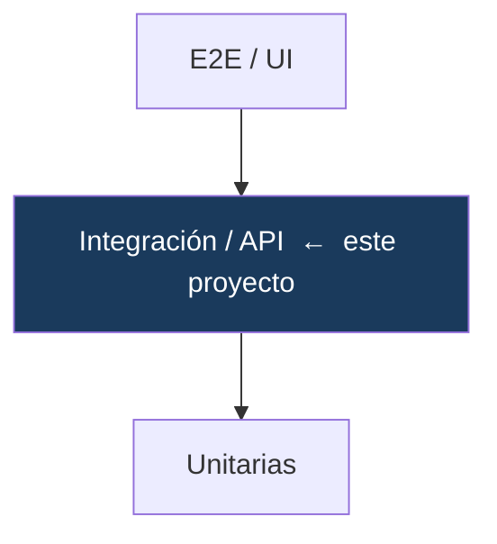
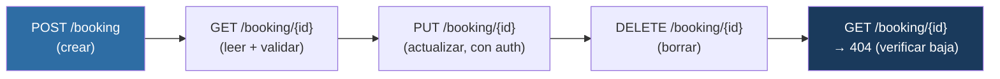

# Framework de Testing de API — Playwright + TypeScript + Zod

Suite de automatización de **pruebas de API** con validación de contratos, construida con **Playwright**, **TypeScript** y **Zod**. Cubre autenticación, CRUD completo, casos negativos, encadenamiento de requests y preparación de datos por API.

---

## Resumen ejecutivo

| | |
|---|---|
| **Qué es** | Una suite que valida una API REST no solo en su comportamiento, sino en el **contrato** de sus respuestas (estructura y tipos de cada campo). |
| **Problema que resuelve** | Verificar un `200 OK` no garantiza nada: una respuesta con un campo faltante o un tipo cambiado rompe al cliente con el test en verde. Este proyecto valida la forma real de cada respuesta y detecta rupturas de contrato. |
| **Alcance** | Autenticación por token, CRUD de reservas, casos negativos (401/403/404), y un flujo end-to-end encadenado. |
| **Resultado** | 12 casos ejecutándose en **~2 segundos, sin navegador**, con validación de contrato en cada respuesta e integración continua. |
| **Stack** | Playwright (`APIRequestContext`) · Zod · TypeScript (`strict`) · GitHub Actions |

---

## Posición en la estrategia de testing



El testing de API cubre la capa intermedia: más rápida y estable que la UI, valida la lógica de negocio del backend directamente por HTTP. Es donde conviene concentrar la mayor parte de la cobertura.

---

## Flujo end-to-end verificado



Cada paso alimenta al siguiente (encadenamiento), y el paso final verifica el **efecto** —que el recurso realmente se eliminó—, no solo el código de respuesta.

---

## Capacidades técnicas

| Capacidad | Implementación |
|---|---|
| **Contract testing** | Schemas de **Zod** validan la forma de cada respuesta en runtime |
| **Tipos derivados del contrato** | `z.infer` → una sola fuente de verdad para validación y tipos |
| **API Clients** | `AuthClient`, `BookingClient` encapsulan los endpoints |
| **Preparación de datos por API** | Fixture que crea los datos de precondición vía API, con limpieza |
| **Casos negativos** | Credenciales inválidas, recurso inexistente (404), sin permiso (403) |
| **Autenticación** | Token por header, probado en endpoints protegidos |
| **Datos con Builder** | Construcción de payloads con copia profunda |
| **Configuración por ambiente** | URL y credenciales por variable de entorno |

---

## Estructura

```
src/
├── config/env.ts        # baseURL + credenciales desde variables de entorno
├── schemas/             # contratos (Zod): validación + tipos
├── clients/             # API Clients (encapsulan los endpoints)
├── data/                # builder de payloads
└── fixtures/            # clients + token + preparación de datos por API
tests/
├── health/  auth/  booking/    # tests por recurso
```

---

## Uso

```bash
npm install                  # no requiere navegadores

npm test                     # suite completa (~2s)
npm run test:smoke           # tests críticos (@smoke)
npm run typecheck
npm run report
```

Configuración por ambiente:

```bash
API_BASE_URL=https://otra-api.com npm test
```

---

## Documentación técnica

**[docs/DOCUMENTACION-TECNICA.md](docs/DOCUMENTACION-TECNICA.md)** detalla el diseño: contract testing con Zod, API Clients, preparación de datos por API, autenticación, encadenamiento, idempotencia y aislamiento sobre un backend compartido.

---

## Contexto

Segundo de una serie de proyectos de automatización de calidad:

1. [Framework E2E de UI (Playwright)](https://github.com/fercarballo/playwright-e2e-framework-saucedemo)
2. **Testing de API** — este repositorio
3. [Pipeline CI/CD (GitHub Actions)](https://github.com/fercarballo/qa-automation-cicd-pipeline)
4. [Estabilidad y flakiness](https://github.com/fercarballo/flakiness-hunting-playwright)
5. [Regresión visual & contract testing](https://github.com/fercarballo/visual-and-contract-testing)

---

## Licencia

MIT.
